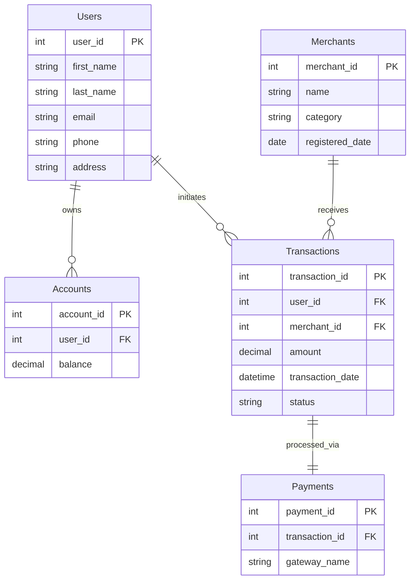

# Paytm Database Design Document

## Part 1: ER Diagram

## Part 2 & 3: Relational Database & Normalization (Removing Functional Dependencies)

To ensure our schema is robust and free of anomalies (such as update, insertion, or deletion anomalies), we structure our tables according to normal forms up to **Boyce-Codd Normal Form (BCNF)** / **Third Normal Form (3NF)**.

### 1. First Normal Form (1NF)
**Rule:** Each cell must contain a single, atomic value. 
**Application:** All our fields like `first_name`, `email`, and `address` hold singular values. (e.g., if a user had multiple addresses, they would be moved to a separate `User_Addresses` table).

### 2. Second Normal Form (2NF)
**Rule:** It must be in 1NF, and all non-key attributes must be fully functionally dependent on the primary key (no partial dependencies).
**Application:** In the `Transactions` table, we do not store merchant information (like `merchant_name`). The `merchant_name` relies only on the `merchant_id` (a partial dependency if `transaction_id` + `merchant_id` was uniquely identifying something together). By moving `merchant_name`, `category`, and `registered_date` into the `Merchants` table, we establish 2NF.

### 3. Third Normal Form (3NF)
**Rule:** It must be in 2NF, and have no transitive dependencies (where a non-key attribute depends on another non-key attribute).
**Application:** If we stored "Total Commission" directly on the merchant table as a static number, it would be transitively dependent on the sum of their transactions. Instead, we calculate commissions dynamically (Query 10), ensuring no redundant data is stored. User details (Name, Email) are kept out of the `Transactions` table, eliminating redundancy.

> **Final Relational Mapping (Schema):**
> * **Users** (user_id [PK], first_name, last_name, email, phone, address)
> * **Merchants** (merchant_id [PK], name, category, registered_date)
> * **Accounts** (account_id [PK], user_id [FK->Users.user_id], balance)
> * **Transactions** (transaction_id [PK], user_id [FK->Users.user_id], merchant_id [FK->Merchants.merchant_id], amount, transaction_date, status)
> * **Payments** (payment_id [PK], transaction_id [FK->Transactions.transaction_id], gateway_name)
